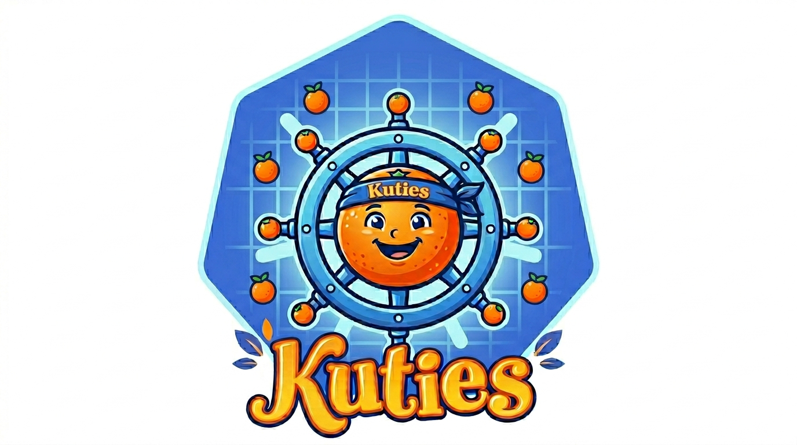

k4s is short for KUTIES, which is Kubernetes plus U-root utiliTIES. 
Unlike other projects, kubernetes tools (e.g. runc) are not embedded as stand-alone binaries; 
rather, they are integrated via the gobusybox. 
In standard u-root, this allows over 180 commands to be built into single binary smaller than 20MiB. 
To be used in k4s, Go programs must be Go buildable with CGO_ENABLED=0. 
This will require us to revisit commands, such as runc, that have evolved over the years and brought in
dependencies on external libraries (e.g. libpathrs) and programs (e.g. nsenter).
With work, these dependencies can be avoided.
U-root is a core firmware component for 10s of millions of server systems around the world, providing a 
compact, safe userland for LinuxBoot systems. 
K4s will allow us to integrated Kubernetes capabilities into firmware images, enabling the creation of diskless Kubernetes
appliances.

